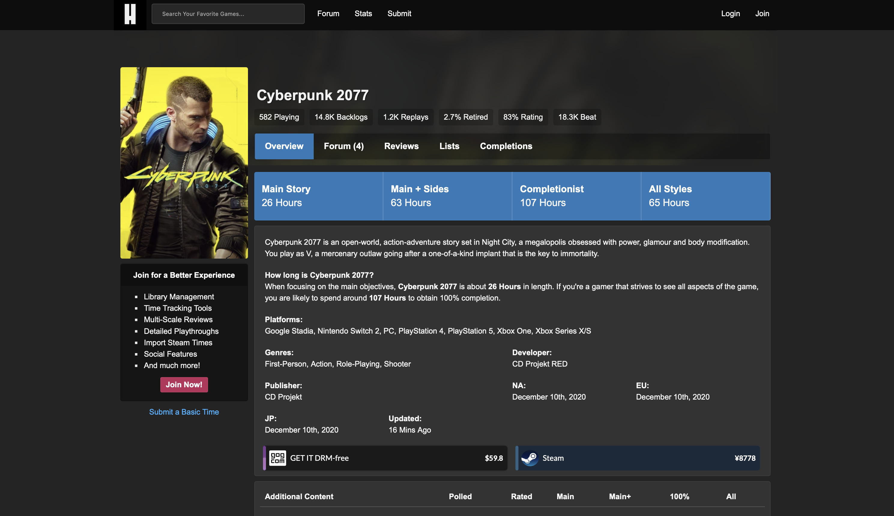

# HowLongToBeat Scraper (async, resilient, deduplicated)

Asynchronous, fault-tolerant web scraper for [howlongtobeat.com](https://howlongtobeat.com) collecting game statistics: completion times, multiplayer modes, release dates.  
Designed as a robust async pipeline with deduplication, retries, label normalization, and clean CSV output. Suitable for long-running data collection and subsequent analysis.

### [Kaggle link](https://www.kaggle.com/datasets/b4n4n4p0wer/how-long-to-beat-video-game-playtime-dataset)

  
<sub>Source: howlongtobeat.com</sub>

## What this project does

- Iterates over pages like `https://howlongtobeat.com/game/<id>` (sequential ID scan)
- Extracts:
  - Game title
  - Content type (game / DLC / multiplayer)
  - All available completion times: `Main Story`, `Completionist`, `Co-op`, etc.
  - Release date (precision: year, month, or day)
  - Number of polled users for each time metric
- Stores all data into `hltb_dataset.csv`
- Logs errors, skips, timeouts, and retries for full transparency

## Key advantages

- Asynchronous fetching (`aiohttp + asyncio`) with controlled concurrency
- Automatic retry with backoff, jitter, and error handling
- Unified label normalization for consistent columns
- Deduplication on resume (no duplicate IDs in CSV)
- Flexible CLI (number of IDs, start point, custom CSV and log paths)
- Clean, well-structured, type-annotated code

## Technologies

- **Python 3.11+**
- **aiohttp** — asynchronous HTTP client
- **asyncio** — concurrency and task scheduling
- **BeautifulSoup4** — HTML parsing
- **CSV** — structured data output
- **Regex** — normalization and data extraction

## How to run

```bash
pip install -r requirements.txt
python main.py 1000 --start 1 --concurrency 8
```